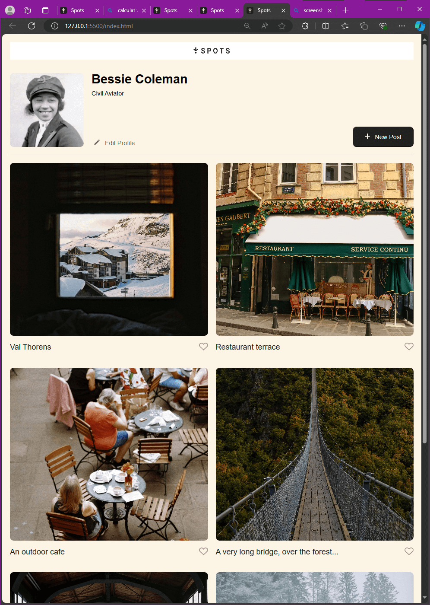
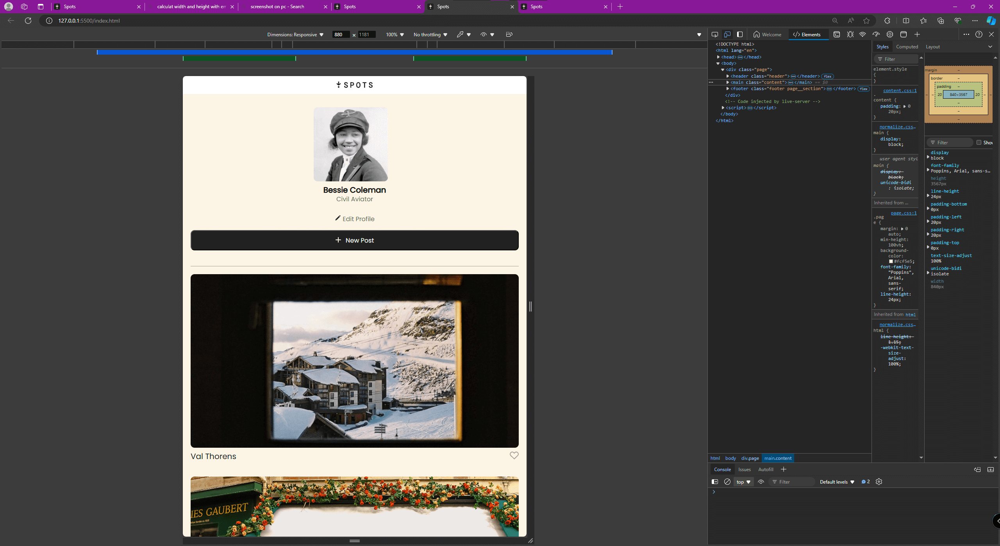

# Project 3: Spots

### Overview

- Intro
- Description
- Images
- Links

**Intro**

This project is made so all the elements are displayed correctly on popular screen sizes. We recommend investing more time in completing this project, since it's more difficult than previous ones.

**Description**

This project is Triple Ten's third project. It uses grid, flexbox, and media queries.

**Images**

**Links**

[Project Link](https://andersonconne.github.io/se_project_spots/)
